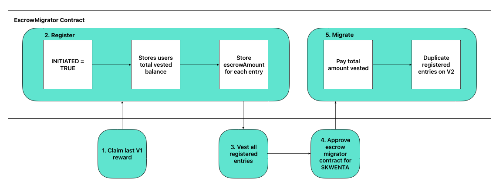

# Staking V2 New Migration Path

- See the PR for the code changes here: https://github.com/Kwenta/token/pull/232

## Intro

The old staking V2 migration path did not allow the migration of V1 escrowed $KWENTA, only liquid $KWENTA. Unfortunately the attempt to account for V1 escrow in the V2 contracts without migrating exposed a vulnerability, and a new migration path was devised.

This new migration path allows both liquid V1 staked $KWENTA and V1 escrowed $KWENTA to be migrated. In order to do this, there is a new contract - the `EscrowMigrator`.

### The Good News

The flow for migrating V1 staked liquid $KWENTA is exactly the same.

### The Bad News - Part 1

The flow for migrating V1 escrowed $KWENTA is a bit complicated and contains an unhappy path, where users can lose money if the front-end doesn’t protect against it. The `EscrowMigrator` contract has been engineered such that a user cannot steal funds from it, they can however lose funds to it if they do not follow the migration flow properly.

It will be the front-ends job to make it impossible for a user to go down the bad path (though a user could still do it by interacting with the contracts directly).

### The Bad News - Part 2

There are gas intensive loops required in two key functions (`registerEntries` & `migrateEntries`) for migrating V1 escrow. The other job of the front-end will be to ensure transactions sent using these loops do not do too many iterations at once, so the transaction does not fail due to an out of gas error.

Hence escrow will have to be migrated in “batches”. Current calculations suggest batches can be up to ~130 entries at a time.

## The Happy Path - use this!

The happy path works for migrating escrowed $KWENTA goes as follows:



Or in words:

1. **Claim last v1 rewards** ---------> `StakingRewardsV1.getReward()`
2. **Register** -----------------------> `EscrowMigrator.registerEntries(entryIDs)`
   - Repeat this step in size ~500 batches until all entries are registered
3. **Vest registered entries** --------> `RewardEscrowV1.vest(EscrowMigrator.getRegisteredVestingEntryIDs(user, 0, 100))`
   - WARNING: do not vest unregistered entries - the user will have to pay extra
4. **Approve EscrowMigrator** ------> `Kwenta.approve(escrowMigrator, EscrowMigrator.toPay(user))`
5. **Migrate** ------------------------> `EscrowMigrator.migrateEntries(to, entryIDs)`
   - Repeat this step in size ~120 batches until all entries are migrated

From here on to migrate liquid $KWENTA it is a continuation of the flow already built:
1. `Unstake` any V1 staked liquid $KWENTA
2. `Stake` the liquid $KWENTA on V2

And that’s it! The user now has all their V1 entries duplicated on V2 and their liquid $KWENTA staked on V2.

The front-end should guide users down this path.

## The Unhappy Path - ensure this is impossible!

It is critical that the front-end team understands the unhappy path, so they can ensure it is impossible to go down using the official Kwenta front-end.

The unhappy path goes like this:
1. Register some entries.
2. Vest some entries have not been registered BEFORE completing the `migrateEntries` step.

If a user does this, they will be required to pay extra $KWENTA to complete the migration process.

### How to ensure this is impossible!

It is pretty easy to ensure that this path is impossible, using the following rules:

An initial "soft" rule should be in place:
- Force the user the register all their entries when they begin the migration process.
  - If the user registers all their unvested entries, they cannot fall into the unhappy path.
    - This is a soft rule as it can be broken without going down the unhappy path (and in the unlikely scenario of a griefing attack - as explained later - we would have to allow this rule to be broken)

A **SUPER IMPORTANT** - and the **MOST IMPORTANT** hard rule:
- Once a user has registered any entries - only allow them to vest entries returned by `EscrowMigrator.getRegisteredVestingEntryIDs(user, 0, numOfRegisteredEntries)`.
  - This rule **MUST ALWAYS BE FOLLOWED** under all conditions, and if it is it will guarantee no one goes down the unhappy path.

As long as the front-end follows these rules, the unhappy path will be impossible to go down via the Kwenta front-end.

### The Unhappy Path Explained

The reason for this is due to a limitation in the way `RewardEscrowV1` works. Initially the kind of migration process we are using now was avoided due to the V1 contracts not supporting this approach.

However after looking deeper into it, a way was found to make the migration work, even within the context of those limitations.

Essentially `RewardEscrowV1` does not call the contract it sends `earlyVestFees` to when it pays them, so there is no immediate way for the receiving contract to know it has been paid, how much it has been paid, or on behalf of who it has been paid. This makes it difficult to calculate how much the user has been charged via early vest fees, and how much they have been paid when vesting early.

In order to get around this, there is one value that can be used on the `RewardEscrowV1` contract to work this out - `totalVestedAccountBalance`.

`RewardEscrowV1` stores the `totalVestedAccountBalance` for each user, and it is updated every time a user vests. It stores how much the user has been paid when vesting. Unfortunately once a user vests, we cannot check what the `escrowAmount` was for each entry, as that value gets set to 0 after vesting.

The work around is to `register` all entries to be migrated, before vesting and migrating them. This allows us to store the `escrowAmount` for each entry, so we can recreate that entry on v2 after it has been vested.

So the approach is:
1. Store the users `totalVestedAccountBalanceAtMigration = totalVestedAccountBalance` at registration time, and store the `escrowAmount` for each entry.
2. Vest the entries.
3. When migrating the entries, check the users `totalVestedAccountBalanceAtRegistration = totalVestedAccountBalance` again - the increase in this value tells us how much the user has been paid when vesting.
4. The user pays `toPay = totalVestedAccountBalanceAtMigration - totalVestedAccountBalanceAtRegistration` - i.e. they pay however much they have been paid since registering when vesting early.
5. The system then uses the stored `escrowAmount` values to recreate the same entries on V2.

The problem comes if a user vests entries that they haven't registered. As each entry vested increases the value of `totalVestedAccountBalance` and hence `totalVestedAccountBalanceAtMigration` and therefore the value of `toPay` as well. But any entries they vest which haven't been registered we won't be able to migrate, as we don't have those entries `escrowAmount` values on-chain. Hence the user will have to pay for entries they won't be able to migrate.

### One Possible Solution and Why it Doesn't Work

It is possible to protect against this issue - simply force the user to register all of their entries at the smart-contract level. If they have to register all of their entries before moving to the next step, then it is more difficult to fall into this trap. However as anyone can create an escrow entry for anyone, with as little as 1 wei in $KWENTA, this would make users susceptible to a griefing attack. An attacker could create many thousands of entries for a user which they would then be forced to register, and hence they would never be able to migrate.

Hence we have chosen the approach where users can't be griefed but can shoot themselves in the foot if they migrate the wrong way. As the long as the front-end makes this impossible though, and people use the front-end and don't try to migrate "their own way", then everyone should be fine.

It is a reasonable tradeoff - users are always able to shoot themselves in the foot in defi anyway - just send money to a wrong address for example!

## Logical Details For Each Step

At each step vesting entries with certain properties should be used.

Here I will define the properties that should be checked for at each step along with some pseudocode.

### Step 1 - Claim final V1 Rewards

We know we are in this state if:
- `stakingRewardsV1.earned(user) > 0` - the user still has V1 rewards to claim

Then we must simply claim those rewards:
```javascript
const earned = stakingRewardsV1.earned(user);

if (earned > 0) {
   // get final v1 rewards
   await stakingRewardsV1.getReward();
}
```

### Step 2 - Register Entries

- Max number per round: ~500

We know we are in this state if:
- `entriesToRegister.length > 0` - some unvested entries have not been registered

We are looking to migrate entries with the following properties:
- `entry.escrowAmount > 0` - the entry has not already been vested
- `registeredEntry.escrowAmount == 0` - the entry has not already been registered

We should collect all those entries and pass them into the `escrowMigrator.registerEntries` function:
```javascript
const numEntries = await rewardEscrowV1.numVestingEntries(user)
const entries = await rewardEscrowV1.getVestingSchedules(user, 0, numEntries)

const registeredEntries = await escrowMigrator.getRegisteredVestingSchedules(user, 0, numEntries)
const registeredEntriesMap = {};
registeredEntries.forEach(entry => {
   registeredEntriesMap[entry.entryID] = true;
})
const entriesToRegister = entries.filter(entry => {
   // must not be vested
   if (entry.escrowAmount == 0) return false;
   // must not already be registered
   if (registeredEntriesMap[entry.entryID]) return false;
   return true;
})

const initiated = await escrowMigrator.initiated(user);
if (entriesToRegister.length > 0) {
   // register entries
   await escrowMigrator.registerEntries(entriesToRegister)
}
```

### Step 3 - Vest Registered Entries

- Max number per round: **UNKNOWN** - further research required

We know we are in this state if:
- `escrowMigrator.initiated(user) == true` - the user must have begun the registration process
- `entriesToRegister.length == 0` - there are no more unregistered, unvested entries
- `entriesToVest.length > 0` - There are more entries to vest

Entries to vest after registration have the following properties:
- `entry.escrowAmount > 0` - it hasn't been vested yet
- `registeredEntry.escrowAmount > 0` - it has been registered on the escrow migrator contract
  - **WARNING** - this point is critical, if any entries are vested at this stage that have not been registered, the user will lose money

Here is the pseudo code:
```javascript
const initiated = await escrowMigrator.initiated(user);
const numRegisteredEntries = await escrowMigrator.numberOfRegisteredEntries(user)
// WARNING: CRITICAL - THIS DATA MUST BE QUERIED FROM `escrowMigrator.getRegisteredVestingEntryIDs` OR THE USER WILL LOSE MONEY
const registeredEntryIDs = escrowMigrator.getRegisteredVestingEntryIDs(user, 0, numRegisteredEntries);

const entriesToVest = registeredEntryIDs.filter(entryID => {
   // check on rewardEscrowV1 if the entry has been vested
   const entry = await rewardEscrowV1.getVestingEntry(user, entryID);
   // only keep entries that haven't been vested yet
   return entry.escrowAmount > 0;
});

if (initiated && entriesToRegister.length == 0 && entriesToVest.length > 0) {
   // vest the entries
   await rewardEscrowV1.vest(entriesToVest)
}
```

## Step 4 - Approve Escrow Migrator

We know we are in this state if:
- `escrowMigrator.initiated(user) == true` - we have started the migration process
- `entriesToRegister.length == 0` - there are no more entries to register
- `entriesToVest.length == 0` - there are not more entries to vest
- `kwenta.allowance(user, escrowMigrator) < escrowMigrator.toPay(user)` - the user hasn't approved the escrow migrator to spend their money

```javascript
const initiated = await escrowMigrator.initiated(user);
const allowance = await kwenta.allowance(user, escrowMigrator)
const toPay = escrowMigrator.toPay(user)
const approved = toPay <= allowance;

if (initiated && entriesToRegister.length == 0 && entriesToVest.length == 0 && !approved) {
   // approve the escrow migrator
   kwenta.approve(escrowMigrator, toPay)
}
```

## Step 5 - Migrate Entries

- Max number per round: ~130

We know we are in this state if:
- `escrowMigrator.initiated(user) == true` - we have started the migration process
- `entriesToRegister.length == 0` - there are no more entries to register
- `entriesToVest.length == 0` - there are not more entries to vest
- `kwenta.allowance(user, escrowMigrator) >= escrowMigrator.toPay(user)` - the user has approved the escrow migrator contract
- `entriesToMigrate.length > 0` - there are no more entries to migrate

```javascript
const initiated = await escrowMigrator.initiated(user);
const allowance = await kwenta.allowance(user, escrowMigrator)
const toPay = escrowMigrator.toPay(user)
const approved = toPay <= allowance;

const numRegisteredEntries = await escrowMigrator.numberOfRegisteredEntries(user)
const registeredEntries = await escrowMigrator.getRegisteredVestingSchedules(user, 0, registeredEntries);

const entriesToMigrate = registeredEntries.filter(entry => {
   // must not already be migrated
   if (entry.migrated) return false;
   return true;
})

if (initiated && entriesToRegister.length == 0 && entriesToVest.length == 0 && approved && entriesToMigrate.length > 0) {
   // assuming we send the new entries to the same user address
   const toAddress  = user
   // migrate the entries
   await escrowMigrator.migrateEntries(toAddress, entriesToMigrate)
}
```

### Step 6 - Unstake any remaining liquid KWENTA

We know we are in this state if:
- `rewardEscrowV1.balanceOf(user) == 0` - there is no escrow left in V1
- `entriesToMigrate.length == 0` - there are no entries left to migrate
- `stakingRewardsV1.balanceOf(user) > 0` - the user still has a balance on staking rewards v1

```javascript
const stakingRewardsV1Balance = await stakingRewardsV1.balanceOf(user)
const rewadEscrowV1Balance = await rewardEscrowV1.balanceOf(user);
if (rewadEscrowV1Balance == 0 && stakingRewardsV1Balance > 0 && entriesToMigrate.length == 0) {
   // unstake the remaining balance
   await stakingRewardsV1.exit()
}
```

### Step 7 - Stake any liquid KWENTA on V2

We know we are in this state if:
- `rewardEscrowV1.balanceOf(user) == 0` - there is no escrow left in V1
- `entriesToMigrate.length == 0` - there are no entries left to migrate
- `stakingRewardsV1.balanceOf(user) == 0` - the user still has nothing left on V1
- `kwenta.balanceOf(user) > 0` - the user has liquid balance

```javascript
const balance = await kwenta.balanceOf(user)

if (rewadEscrowV1Balance == 0 && stakingRewardsV1Balance == 0 && entriesToMigrate.length == 0 && balance > 0) {
   // stake liquid KWENTA in V2
   stakingRewardsV2.stake(balance)
}
```

And that is it! Phew.

I wrote all this logic out all very quickly and roughly, so there may be bugs.

This is just pseudo code, it needs going over much more closely and testing properly.
