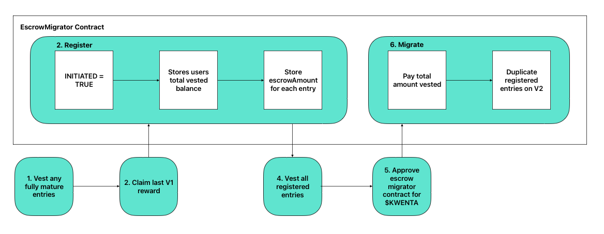

# Staking V2 New Migration Path

## Intro

The old staking V2 migration path did not allow the migration of V1 escrowed $KWENTA, only liquid $KWENTA. Unfortunately the attempt to account for V1 escrow in the V2 contracts without migrating exposed a vulnerability, and a new migration path was devised.

This new migration path allows both liquid V1 staked $KWENTA and V1 escrowed $KWENTA to be migrated. In order to do this, there is a new contract - the `EscrowMigrator`.

### The Good News

The flow for migrating V1 staked liquid $KWENTA is exactly the same.

### The Bad News - Part 1

The flow for migrating V1 escrowed $KWENTA is a bit complicated and contains an unhappy path, where users can lose money if the front-end doesn’t protect against it. The `EscrowMigrator` contract has been engineered such that a user cannot steal funds from it, they can however lose funds to it if they do not follow the migration flow properly.

It will be the front-ends job to make it impossible for a user to go down the bad path (though a user could still do it by interacting with the contracts directly).

### The Bad News - Part 2

There are gas intensive loops required in two key functions (`registerEntries` & `migrateEntries`) for migrating V1 escrow. The other job of the front-end will be to ensure transactions sent using these loops do not do too many iterations at once, so the transaction does not fail due to an out of gas error.

Hence escrow will have to be migrated in “batches”. Current calculations suggest batches can be up to ~140 entries at a time.

## The Happy Path

The happy path works as follows:

1. **Vest mature v1 entries** --------> `RewardEscrowV1.vest(fullyMatureEntryIDs)`
2. **Claim last v1 rewards** ---------> `StakingRewardsV1.getReward()`
3. **Register** -----------------------> `EscrowMigrator.registerEntries(entryIDs)`
   - Repeat this step in size ~200 batches until all entries are registered
4. **Vest registered entries** --------> `RewardEscrowV1.vest(EscrowMigrator.getRegisteredVestingEntryIDs(user, 0, 100))`
   - WARNING: do not vest unregistered entries - the user will have to pay extra
6. **Approve EscrowMigrator** ------> `Kwenta.approve(escrowMigrator, EscrowMigrator.toPay(user))`
7. **Migrate** ------------------------> `EscrowMigrator.migrateEntries(to, entryIDs)`
   - Repeat this step in size ~120 batches until all entries are migrated

From here on it is a continuation of the previous flow:
1. `Unstake` any V1 staked liquid $KWENTA
2. `Stake` the liquid $KWENTA on V2

And that’s it! The user now has all their V1 entries duplicated on V2 and their liquid $KWENTA staked on V2

## The Unhappy Path

It is critical that the front-end team understands the unhappy path, so they can ensure it is impossible to go down using the official Kwenta front-end.

The unhappy path goes like this:
1. Register some entries.
2. Vest some entries have not been registered BEFORE completing the `migrateEntries` step.

If a user does this, they will be required to pay extra $KWENTA to complete the migration process.

### The Unhappy Path Explained

The reason for this is due to a limitation in the way `RewardEscrowV1` works. Initially the kind of migration process we are using now was avoided due to the V1 contracts not supporting this approach.

However after looking deeper into it, a way was found to make the migration work, even within the context of those limitations.

Essentially `RewardEscrowV1` does not call the contract it sends `earlyVestFees` to when it pays them, so there is no immediate way for the receiving contract to know it has been paid, how much it has been paid, or on behalf of who it has been paid. This makes it difficult to calculate how much the user has been charged via early vest fees, and how much they have been paid when vesting early.

In order to get around this, there is one value that can be used on the `RewardEscrowV1` contract to work this out - `totalVestedAccountBalance`.

`RewardEscrowV1` stores the `totalVestedAccountBalance` for each user, and it is updated every time a user vests. It stores how much the user has been paid when vesting. Unfortunately once a user vests, we cannot check what the `escrowAmount` was for each entry, as that value gets set to 0 after vesting.

The work around is to `register` all entries to be migrated, before vesting and migrating them. This allows us to store the `escrowAmount` for each entry, so we can recreate that entry on v2 after it has been vested.

So the approach is:
1. Store the users `totalVestedAccountBalanceAtMigration = totalVestedAccountBalance` at registration time, and store the `escrowAmount` for each entry.
2. Vest the entries.
3. When migrating the entries, check the users `totalVestedAccountBalanceAtRegistration = totalVestedAccountBalance` again - the increase in this value tells us how much the user has been paid when vesting.
4. The user pays `toPay = totalVestedAccountBalanceAtMigration - totalVestedAccountBalanceAtRegistration` - i.e. they pay however much they have been paid since registering when vesting early.
5. The system then uses the stored `escrowAmount` values to recreate the same entries on V2.

The problem comes if a user vests entries that they haven't registered. As each entry vested increases the value of `totalVestedAccountBalance` and hence `totalVestedAccountBalanceAtMigration` and therefore the value of `toPay` as well. But any entries they vest which haven't been registered we won't be able to migrate, as we don't have those entries `escrowAmount` values on-chain. Hence the user will have to pay for entries they won't be able to migrate.

### One Possible Solution and Why it Doesn't Work

It is possible to protect against this issue - simply force the user to register all of their entries. If they have to register all of their entries before moving to the next step, then it is more difficult to fall into this trap. However as anyone can create an escrow entry for anyone, with as little as 1 wei in $KWENTA, this would make users susceptible to a griefing attack. An attacker could create many thousands of entries for a user which they would then be forced to register, and hence they would never be able to migrate.

Hence we have chosen the approach where users can't be griefed but can shoot themselves in the foot if they migrate the wrong way. As the long as the front-end makes this impossible though, and people use the front-end and don't try to migrate "their own way", then everyone should be fine.

It is a reasonable tradeoff - users are always able to shoot themselves in the foot in defi anyway - just send money to a wrong address for example!

