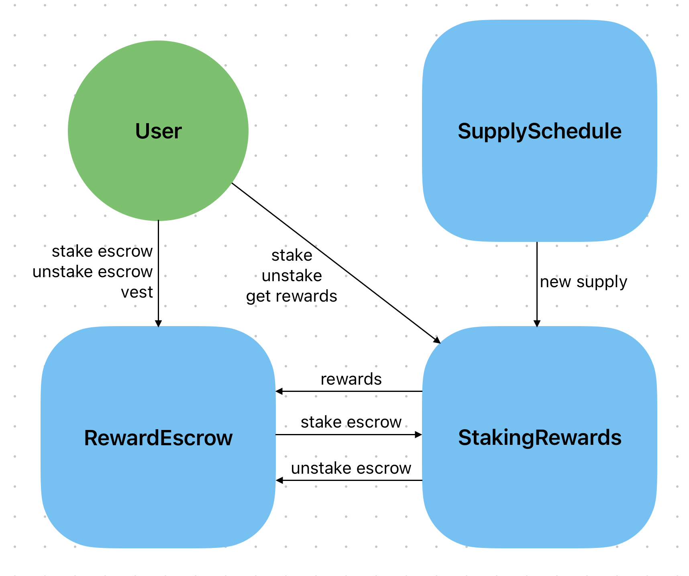
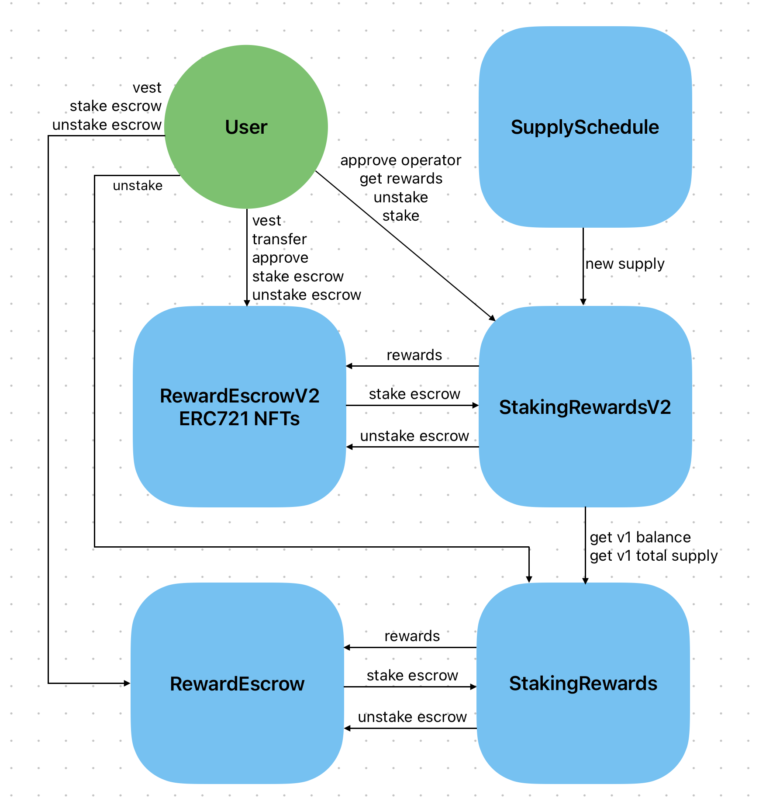

# Staking V2

Staking V2 is going through it's final refinements and is about to be sent to audit. This document outlines the changes that have been made to the contracts and what will be done to make the migration happen.

Link to PR with the latest code: https://github.com/Kwenta/token/pull/213

# New Features and Changes

## Unstaking Cooldown Period

- There is now an unstaking cooldown period for v2. This is set to 2 weeks by default, but can be changed by the admin.
  - During the cooldown period it is not possible to unstake.
    - The exception to this is when vesting - staked escrow will bypass the cooldown period when vesting.
  - Once the cooldown period has passed, the user can then unstake.
  - Every time a user stakes (any amount) the cooldown timer is reset.
  - The following functions are effected by the cooldown:
    - `StakingRewardsV2.userLastStakeTime(address user)`
    - `StakingRewardsV2.unstake(uint256 amount)`
    - `RewardEscrowV2.unstakeEscrow(address account, uint256 amount)`
    - `RewardEscrowV2.transferFrom(address from, address to, uint256 tokenId)`
      - The reason the `transferFrom` is affecting is that escrow entries cannot be transferred unless they are unstaked.

## V2 Escrow Entries are now ERC721 Tokens (NFTs)

This means it is now possible to transfer escrow entries.
- `RewardEscrowV2.transferFrom(address from, address to, uint256 tokenId)`
- `RewardEscrowV2.bulkTransferFrom(address from, address to, uint256[] calldata entryIDs)`

Each NFT has the following metadata:
```solidity
struct VestingEntry {
    uint256 escrowAmount; // how much kwenta is escrowed
    uint256 duration; // how long the vesting period is
    uint64 endTime; // when the vesting period ends
    uint8 earlyVestingFee; // the % fee to pay if the user wants to vest early (reduces over time)
}
```

There are a few things to be aware of:
1. If the user wants to transfer an escrow entry, they must have sufficient unstaked escrow before transferring.
   - This means if all of their escrow is staked, they will first have to unstake some of it before transferring an entry.
     - Users won't be able to do this during the cooldown period.
2. The `RewardEscrowV2.balanceOf` function has a different meaning to the V1 `RewardEscrow.balanceOf` function.
   - In v1 `balanceOf` meant a users total amount of escrowed balance.
   - In v2 `balanceOf` means the number of NFTs/escrow entries a user has. This is because of the ERC721 standard.
     - In v2 the to get a users total escrowed balance you must use `RewardEscrowV2.totalEscrowedBalanceOf(address account)`
3. The escrow entry NFTs will burnt when vested.

This unlocks all the following functions for escrow entries:
```solidity
RewardEscrowV2.safeTransferFrom(address from, address to, uint256 tokenId)
RewardEscrowV2.transferFrom(address from, address to, uint256 tokenId)
RewardEscrowV2.bulkTransferFrom(address from, address to, uint256[] calldata entryIDs)
RewardEscrowV2.balanceOf(address account)
RewardEscrowV2.ownerOf(uint256 tokenId)
RewardEscrowV2.approve(address to, uint256 tokenId)
RewardEscrowV2.getApproved(uint256 tokenId)
RewardEscrowV2.setApprovalForAll(address operator, bool approved)
RewardEscrowV2.isApprovedForAll(address owner, address operator)
RewardEscrowV2.totalSupply()
RewardEscrowV2.tokenOfOwnerByIndex(address owner, uint256 index)
RewardEscrowV2.tokenByIndex(uint256 index)
```

## Historical values (checkpointing)

It is now possible to query historical staking values on the `StakingRewardsV2` contract.

This could be used for a cool dashboard with a graph of different staked values over time.

- This adds the following new functions:
  - `StakingRewardsV2.balanceAtTime(address account, uint256 _timestamp)`
  - `StakingRewardsV2.escrowedbalanceAtTime(address account, uint256 _timestamp)`
  - `StakingRewardsV2.totalSupplyAtTime(uint256 _timestamp)`

## Delegation

Users now have the ability to delegate the ability to claim rewards and stake escrow.

- This adds the following the new functions:
  - `StakingRewardsV2.approveOperator(address operator, bool approved)`
  - `StakingRewardsV2.stakeEscrowOnBehalf(address account, uint256 amount)`
  - `StakingRewardsV2.getRewardOnBehalf(address account)`

## New Admin Features

- Ability to set a cooldown period
  - `StakingRewardsV2.setCooldownPeriod(uint256 _cooldownPeriod)`

# The Great Migration

Due to the immutability of the v1 contracts, there are some constraints we are working with that make the migration process more complicated.

Here is a brief overview of the migration process.

## StakingV1

The old system was simpler and looked something like this:



There were two main contracts to be aware of:
1. `RewardEscrow` - where users escrowed tokens are stored and vested.
2. `StakingRewards` - where users staked tokens are stored and rewards are claimed.

There was also `SupplySchedule` which mints the new supply to `StakingRewards`, but as a consumer of the contracts you don't really need to know about that.

## StakingV2

As not all tokens can be moved from V1 to V2, we decided to make StakingV2 aware of StakingV1 stake and take that into account when calculating rewards.

Here is a diagram of the new system:



As you can see the new system is more complicated, as not only is there new functionality, but it also has to be aware of the old system and take it's balances into account when calculating rewards.

## Migration Process

The migration process follows these steps:
1. Deploy and setup the new contracts - `StakingRewardsV2` and `RewardEscrowV2`.
2. Point `SupplySchedule` to `StakingRewardsV2` instead of `StakingRewards`. At this point there will be no new supply sent to v1, but old uncollected v1 rewards will still be claimable on the v1 contract. Any newly generated supply will be sent to v2, and will have to be claimed on that contract.
3. Encourage users to unstake on v1 and restake on v2 - they are incentivised to do this as they will get a higher reward rate on v2. This is because some extra rewards based on the checkpointing system will only be available for funds staked on v2. These rewards will be taken from historical and future vest early penalty fees - of which 50% will be shared with v2 stakers.
4. Overtime we can phase out v1, but the RewardEscrow funds are locked in v1 for at least another year, so while it is the case that a significant amount of funds are still in v1, we will have to support it.

## Summary

The new front-end will need to support both v1 and v2, and will need to have a UX that explains the difference between the two, encourages users to migrate to v2 and allows users to easily switch between interacting with v1 and v2.

Nearly full functionality will need to be supported for V1 - the only thing that we may want to remove is the ability to stake, as we want to discourage further staking on V1. This unfortunately cannot be paused as we need to allow users to stake their escrow, as that will be locked and we want them to be able to claim rewards for staked escrow while they are locked in.

StakingV2 front-end functionality should reach at least V1 parity by the time of release, but ideally we would like to also support the following new functionality:
- Explanation of and visibility into cooldown system.
- Ability to transfer and bulk transfer escrow entries and all other associated NFT functionality (approvals etc.)
- Delegation of the ability to claim rewards and stake escrow.
- Some cool use of historical values (checkpointing) - maybe a graph of different staked values over time.
