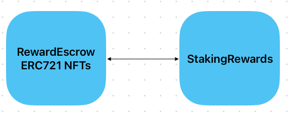

# StakingV2 NFT Options

There are 3 main options (and 1 wildcard) for how to implement NFTs in the system:
1. RewardEscrow NFTs
2. Account NFTs
3. Beacon Accounts
4. Wildcard - Composable NFTs

## 1.RewardEscrow NFTs

ERC721 `RewardEscrow` Escrow Entry NFTs with `bulkTransferFrom` function.
Each individual escrow entry is an ERC721 NFT in `RewardEscrow`.

### Pros

- Simplest code change - code already done
- No need to change `StakingRewards` contract
- Minimal changes to `RewardEscrow` contract

### Cons

- Cannot transfer escrow entries that are staked - have to wait for the cooldown period to end and then unstake first
- To fully migrate to a new address there are a few steps:
  - Unstake all escrowed stake (wait for cooldown period)
  - Query list of all escrow entries
  - Pass list into `bulkTransferFrom` function to transfer them all
  - Unstake any non-escrowed stake (wait for cooldown period)
  - Transfer KWENTA to new address
  - Stake KWENTA with `StakingRewards` contract

## 2. Account NFTs

ERC721 `StakingAccount` contract NFTs which hold escrow entries and stake with `StakingRewards`.
Escrow Entries and stake are registered with `StakingRewards` contract using `accountId` instead of address.

### Pros

- Simplifies overall workflow - can do everything through `StakingAccount` contract
- No need for a `Beacon` or `Factory` contract
- No need to deploy a new `StakingAccount` contract for each user - cheaper
- Allows for transfer of escrow entries that are staked - no need to wait for cooldown period to end
- Can transfer a whole position (escrow entries + staked KWENTA) to a new address in one transaction - `transferFrom`

### Cons

- Requires changes to `StakingRewards` contract (switch addresses for `accountId`s)
- Requires changes to `RewardEscrow` contract (switch addresses for `accountId`s)
- Complexity of `StakingAccount` contract

## 3. Beacon Accounts

Escrow Entry NFTs & Beacon Account Contracts.

ERC721 `RewardEscrow` Escrow Entries with `StakingAccount` contract.
Each individual escrow entry is an ERC721 NFT in `RewardEscrow`.
Each user deploys a `StakingAccount` contract that holds the escrow entries and stakes with `StakingRewards`.
User can transfer ownership of their `StakingAccount` contract to a new address.

### Pros

- No need to change `StakingRewards` contract
- Minimal changes to `RewardEscrow` contract - this is already done
- Allows for transfer of escrow entries that are staked - no need to wait for cooldown period to end
- Can transfer whole position to a new address in one transaction - `transferOwnership`
- Simplifies overall workflow - can do everything through `StakingAccount` contract

### Cons

- Need to deploy a new `StakingAccount` contract for each user - expensive
- Complexity of `StakingAccount` contract
- Complexity of Beacon & Factory setup

## 4. Wildcard - Composable NFTs

ERC-998 proposes a standard for NFTs being able to own NFTs.
In this setup you have an ERC998 `StakingAccount` contract NFTS that own ERC721 `RewardEscrow` escrow entry NFTS.

### Pros

- `StakingRewards` can stay the same and we already have the code for `RewardEscrow` ERC721 escrow entry NFTs
- Can transfer all escrow entries at once and have ERC721 compliant escrow entry NFTs

### Cons

- Complexity of ERC998 `StakingAccount` contract
- ERC998 is not widely adopted
- No openzeppelin implementation of ERC998
- Unknown unknowns - this is a wildcard option - haven't thought about it too deeply
