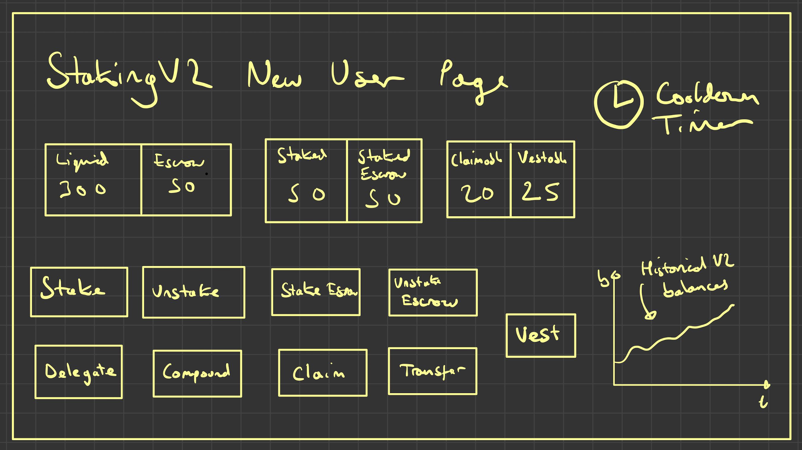
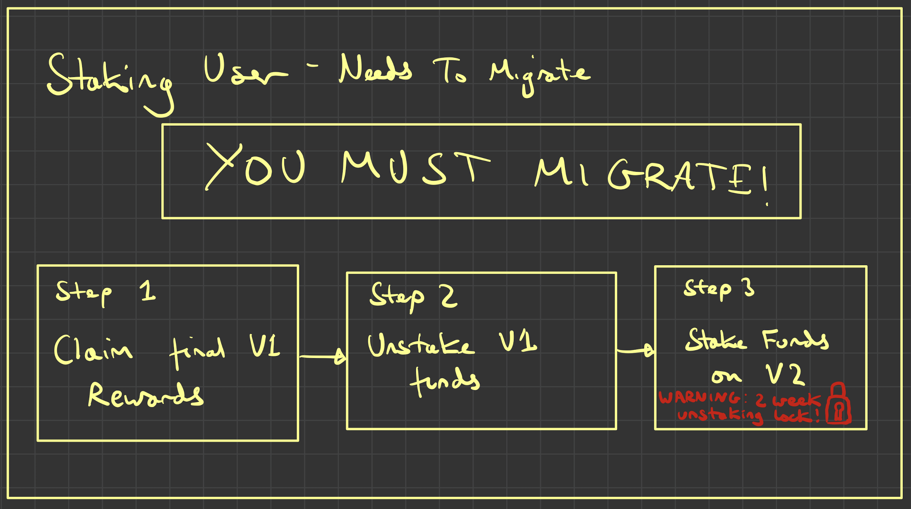
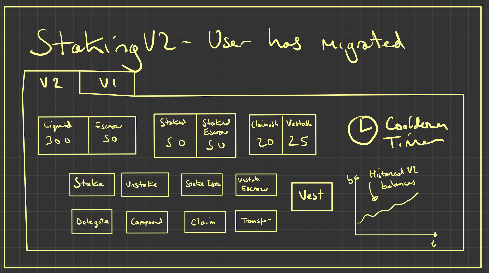
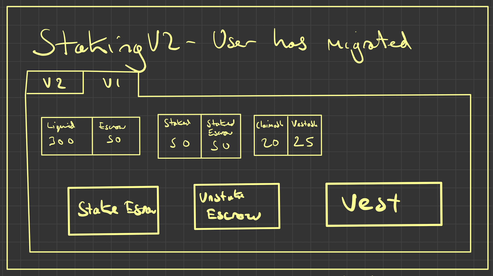

# Staking V2 User Flows

There are 3 types of users of staking V2:
1. New Users - Have never used v1
2. Old Users - Have used v1 but haven't migrated
3. Migrated Users - Have used v1 and have migrated to v2

I will now illustrate a brief idea of the sort of flow we can do for each user:

## New Users

This user:
- Has no has v1 staking balance or reward escrow v1 balance

Formally this user has the following properties:
- `stakingRewardsV1.balanceOf(user) == 0 AND rewardEscrowV1.balanceOf(user) == 0`

The design here has no notion of staking v1 - it just offers all the v2 functionality:
- Stake
- Unstake
- Stake Escrow
- Unstake Escrow
- Delegating (give other addresses the power to collect rewards and stake escrow on your behalf)
- Claiming rewards
- Compounding (single transaction for claim and stake escrow)
- Vesting entries
- Transferring escrow entries (NFTs)

It also hows the following balances:
- Liquid KWENTA
- Escrowed KWENTA
- Staked KWENTA
- Staked Escrow
- Claimable KWENTA
- Vestable KWENTA

Bonus:
- Show a cooldown timer
- Show a graph of historical balances over time

## Old Users

This user:
- Has a v1 staking balance (either staked or unclaimed rewards)
- Has to do step 1 if they have unclaimed v1 rewards
- Has to do step 2 if they have non escrow staked v1 balance
- Should be heavily suggested to do step 3 if they have done step 2

Formally this user has the following properties:
- `Do Step 1 IF stakingRewardsV1.earned(user) > 0`
- `Do Step 2 IF stakingRewardsV1.nonEscrowedBalanceOf(user) > 0`
- `Do Step 3 IF has done step 2`

The design has the following steps:
1. Claim any remaining rewards on staking V1
2. Unstake any non escrowed balance on staking V1
3. Stake any unstaked balance on staking V2

It also shows a warning that once they stake on V2 (step 3) - their funds will be locked for 2 weeks.

## Migrated Users

This user:
- Has v1 escrow entries, but no non-escrowed v1 staked balance or unclaimed V1 rewards

Formally this user has the following properties:
- `stakingRewardsV1.earned(user) == 0 AND stakingRewardsV1.nonEscrowedBalanceOf(user) == 0 AND rewardEscrowV1.balanceOf(user) > 0`

For this design I have offered one page with 2 tabs:

The first tab is exactly the same as what we have for new users.

However there is also a tab that gives them access to control their v1 escrow entries, with limited functionality.

On the V2 tab they can do everything that users can on the `New User` page.

On the V1 tab, they have access to the following limited functionality:
- Unstaking Escrow
- Staking Escrow
- Vesting

They can also see on the V1 tab their V1 balances.

## Conclusion

This is my rough idea of how the user flows could work.

Obviously this design could be significantly shifted, but the purpose of this document is to illustrate the sort of flows we could do, and the concepts of what is essential/needed for the flow to work.
