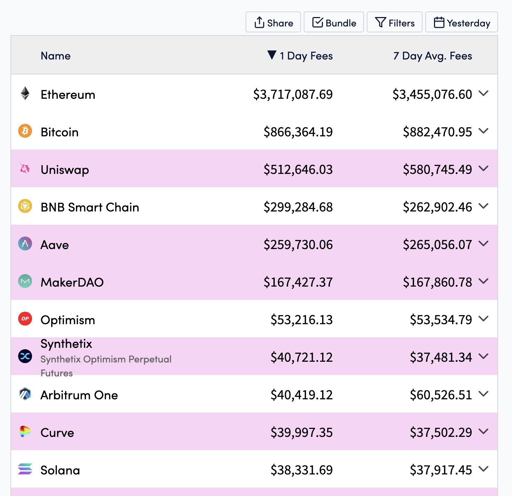

# Notes

## V2

V2 is on Ethereum and Optimistic Ethereum

## V3

LPs can delegate collateral to liquidity pools, and then take out a loan of snxUSD stablecoins. This is effectively a collateralized debt position - similar to on [Liquity](https://www.liquity.org/).

Liquidity pool managers can configure pools to extend credit to derivatives markets.

These markets use Chainlink and Pyth as price oracles, allow the creation of synthetic assets known as synths.

These synthetic assets track the price of the underlying asset via the given decentralised price oracle.

By offering credit to these markets, the pools collect fees (via order fees and liquidations).

These fees reduce the debt of liquidity providers positions, incentivising depositing liquidity into pools.

## The Two Types of Synthetic Assets

The two types of synths are:
1. Perpetual Futures
2. Spot Synths

### Perpetual Futures

Similar to how liquidity pools in uniswap are the counterparty to any swaps, the SNX debt pool is the counterparty to any derivate positions.

While in uniswap the main risk for LPs is impermanent loss, in the SNX debt pool the main risk is the market skew.

If the market is skewed, that means the debt pool is taking a directional position on a given synthetic asset.

In this scenario the debt pool can lose money if the market moves against the direction of the market skew.

The goal of the debt pool is to be delta neutral (this means unaffected by the price movement of any given asset), and this is only true for a given synthetix market if its skew is zero.

Hence there is an incentivisation mechanism for markets to continually move towards 0 market skew.

This is called the funding rate, which will be explained in more depth later.

For now though you can just think of it as meaning that the heavier side of the market pays a continual fee to the lighter side of the market to encourage a neutral balance.

This allows the debt-pool to take the other side of leverage long and short positions, allowing derivatives trading on-chain.

## The Debt Pool

Anyone can enter the debt pool by purchasing and staking SNX tokens.

### Spot Synths

Spot Synths are simply assets that track the value of real-assets via a price oracle.

This allows the minting on-chain of essentially any asset that has a price oracle feed.

In this way gold, silver, stocks, bitcoin, and any other asset can be minted on-chain and integrated into the composable nature of DeFi.

### Governance

Governed by DAOs:
- Spartan Council
  - Votes on upgrades and configuration changes (SIP/SCCPs)
- Grants Council
- Ambassador Council
- Treasury Council

- Voting
  - Stake SNX
  - Vote on the Synthetix Governance Module (every 4 months)

## Synthetix V3 Changes

- Synthetix v2 is one configuration of what Synthetix v3 is capable of
- Synthetix v3 is a generalized version of v2; a toolkit for creating a wide range of DeFi protocols and more
- Synthetix v2 is a product, Synthetix v3 is the platform
- Synthetix v2 can be thought of as a narrow application of Synthetix v3
- Synthetix v3 is the collection of lego pieces, v2 is just one of the things you can create

### Components

- Pools
  - A collection of collateral connected to one or more markets.
- Oracle Manager
  - Agnostically accepts a range of on-chain and off-chain oracle prices
- Markets
  - Interacts with Pools, Oracle Managers and the rest of defi to perform a function (e.g. a game, insurance market, perpetual futures)
  - A profitable market overtime deposits more stables into the pool than it withdraws
- Rewards Distributors
  - Can be used by pool owners to bootstrap or incentivise liquidity independent of market performance (how much stable coins the market deposits to the pool).

The vision is to make the creation and management of components permissionless, meaning anyone can create and administer them on any EVM compatible chain and create just about any defi product based upon these fundamental parts.

## List of things you could build on v3

- Perpetual Futures / Options / Structured Products: trading using synthetic assets to represent leveraged positions for perpetual futures, including basis trading, and funding rate arbitrage vaults. GMX could be built on Synthetix v3.
- NFT-Fi borrowing/perpetuals: Users can borrow synthetic assets collateralized by NFTs or create perpetual contracts speculating on the future value of NFTs, with rewards distributed to Synthetix stakers. For instance, nftperp.xyz could be built on Synthetix v3
- Insurance markets: Users can purchase insurance contracts for various risks, collateralized by Pools and governed by smart contracts. Eg Nexus Mutual could be built on Synthetix v3.
- Prediction markets / Binary Options / Sports Bettings: Users can trade shares based on the outcome of events, such as election results or sports games. Overtime Markets, for example, could be built on Synthetix v3.
- Games: any game could leverage Synthetix collateral, to provide competitive prizes. Eg a lottery is easy to implement on Synthetix v3.
- Offchain / RWA Markets: Markets could be developed for real-world assets such as art, carbon credits or other offchain assets or instruments. With sufficient oracles and trusted entity verification, this "trust" could generate capital on chain, backed by Synthetix and snxUSD. The opportunities are endless.

## Overview

Currently Synthetix V3 is in alpha and is not fully operational, but is set to take over Synthetix V2 as one of the most popular protocols in all of crypto.

As you can see Synthetix V2 is currently generating ~ $40k in fees per day, as the 8th largest fee generating protocol in crypto.

This is mostly due to the popularity of perps (otherwise known as perpetual futures) - a derivatives trading product that allows traders to take leveraged long and short positions on any given asset.

Synthetix V3 is a generalized version of Synthetix V2, and is a toolkit for creating a wide range of DeFi protocols and more.

Synthetix V2 can be thought of as a narrow application of Synthetix V3.

## Other new features

- Cross-margin
- Cannon proxy system
- multi-collateral
- Improved events
- Improved delegation and hence automation

## Not yet released

- Rewards Distributed
- Perps on V3
- Markets are not yet deployed - hence no incentive to move over from V2 yet
- Plans to shift inflation towards V3 as a migration incentive
- Teleporters to allow burning sUSD on one chain and minting on another.
  - Could be expanded to all synths
- Cross chain pool synthesis
  - Vision to make synthetix behave across all chains as a single system with shared homogenous liquidity
  - SIP-312 enables Markets and Pools on all chains know the current state of the combined collateral across all chains
  - Perps markets deployed to all chains will be able to utilise liquidity on op and l1 eth
  - Crosschain Pools require both CCIP Write and Chainlink Functions to be deployed to all networks that require this feature
- Permissionless Pools and Markets - the End Game
  - Currently only the spartan council can create and administer pools and markets
  - Plan is to make this entirely permissionless

## v3GM

## Questions

- Can a market plug into multiple pools?
  - Yes, there is a many-to-many relationship between them.
